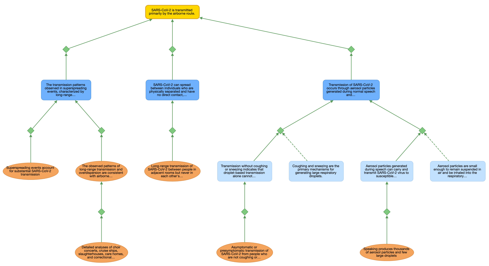

# ArgGraph

ArgGraph is a framework for representing scientific arguments as directed acyclic graphs. It includes tools for querying and visualizing argument graphs. The framework is designed for compatibility with Bayesian networks, with documented CPT generation rules for downstream probabilistic analysis.

[](https://blue-eclectus.github.io/SciArgGraph/examples/visualization.html)
*Click the image to explore the interactive version. This graph represents reasoning from a portion of [this paper](https://dx.doi.org/10.1016/S0140-6736(21)00869-2).*

## Overview

Scientific arguments often involve complex inferential relationships that are difficult to represent formally. ArgGraph provides a structured way to represent scientific arguments as graphs, where each claim is a node and the inferential relationships between claims are explicit edges. This makes it possible to visualize the overall structure of an argument, trace the evidential support for any claim back to its sources, identify weaknesses or gaps, and ultimately convert the argument into a Bayesian network for probabilistic reasoning.

The framework is designed around a lean ontology that prioritizes clarity and compatibility with probabilistic inference. Every node represents something that can be true or false (e.g. empirical findings, assumptions, intermediate claims, and conclusions), and edges make the inferential relationships between them explicit.

This project provides:

- **Ontology**: A lean schema where truth-valued claims are central, support/undermine relationships are first-class nodes (reified links), and the structure maps cleanly to Bayesian networks
- **Graph Model**: A NetworkX-backed data structure with rich query and traversal capabilities
- **Visualization**: Export to DOT, SVG, interactive HTML (Cytoscape), and hierarchical text outlines
- **Schema Validation**: JSON Schema for validating argument graph files

## Key Concepts

### Node Types

The ontology distinguishes between three types of truth-valued claims, plus a special node type for relationships:

**Conclusion**: The main claim being argued—what the argument is ultimately trying to establish. In a well-formed argument graph, conclusions sit at the top of the hierarchy, supported (directly or indirectly) by the argument structure beneath them. A graph can have multiple conclusions representing related claims being argued together.

**Proposition**: A claim that can serve as an assumption (unsupported premise) or as an intermediate claim (supported premise) in the argument. Unlike Datums, they have no required provenance; unlike Conclusions, they aren't the final claim being argued.

**Datum**: An empirical finding tied to a specific source (paper, dataset, observation). Datums provide the evidentiary foundation of an argument, with each one having a source field identifying its provenance. Datums are claims about what was observed, not raw facts—observations can be flawed or misinterpreted.

**Link**: A node representing a support or undermine relationship between claims. Making relationships into nodes (rather than simple edges) enables joint premises, attacks on specific inferences, and auxiliary claims needed for an inference. Links are what make this ontology expressive enough for real arguments (see below).

### Why Links Are Nodes in this Framework (Reification)

In a simple argument graph, you might just draw an arrow from "Evidence E" to "Claim C" to show that E supports C. But real scientific arguments are more complex:

1. **Joint premises**: Sometimes a claim is only supported by multiple pieces of evidence *taken together*. "The drug is effective" might require both "The trial showed positive results" AND "The trial methodology was sound." Neither alone is sufficient. By making Link a node with multiple `source_ids`, we can represent that L1 has sources [D1, D2] pointing to C1—capturing the joint dependency. This is distinct from independent support, where multiple pieces of evidence each support a claim on their own (represented as separate Links to the same target).

2. **Undercutting**: Sometimes evidence doesn't directly contradict a claim, but instead attacks the reasoning connecting other evidence to that claim. "The study was unblinded" doesn't say the drug doesn't work—it undermines the inference from trial results to the effectiveness claim. By making Links targetable, we can have L2 (undermining) point to L1, not to C1. This is distinct from rebutting, where evidence directly undermines the claim itself.

3. **Auxiliary Claims**: Sometimes an inference relies on background claims that may be implicit. For instance, the inference from "the trial showed positive results" to "the drug is effective" implicitly relies on an assumption like "the outcome measure validly captures effectiveness." Philosophers of science often refer to these as "auxiliary assumptions" or "auxiliary claims." By including auxiliary claims as sources in a joint Link, we make these assumptions explicit and available for scrutiny.

### Polarity: Support and Undermining

Each Link has a `polarity` field that is either `"supports"` or `"undermines"`:

- **Supports**: The source claim(s) provide evidence for the target
- **Undermines**: The source claim(s) provide evidence against the target

This maps cleanly to how Bayesian networks encode probabilistic influence. An undermining link from D1 to P1 means P(P1|D1) < P(P1); a supporting link means P(P1|D1) > P(P1).

### Quantitative Parameters

The framework includes two parameters to support Bayesian network conversion:

| Parameter | Location | Default |
|-----------|----------|---------|
| `base_rate` | Claim nodes | 0.5 |
| `strength` | Links | 0.8 |

Base rate represents the probability of a claim when none of its supporting links are active—the baseline credence that evidence in the graph shifts up or down.

Strength controls how strongly evidence propagates through each Link—higher values mean the source has more influence on the target's probability. For instance, a Link from a large randomized controlled trial might have high strength (0.9)—the trial results strongly influence our credence in the conclusion. A Link from a small observational study might have lower strength (0.5), reflecting weaker evidential support.

**CPT Generation for Bayesian Networks:**

The table below summarizes default formulas for generating conditional probability tables (CPTs) when converting to a Bayesian network. See docs/ontology_spec.md for detailed derivations and examples.

| Pattern | Formula |
|---------|---------|
| Single support | `P = β + s(1-β)` |
| Single undermine (no supports) | `P = β(1-s)` |
| Joint link (all sources required) | `P = β + s(1-β)` when ALL sources true, else `P = β` |
| Independent supports (noisy-OR) | `P = 1 - (1-β)∏(1-sᵢ)` |
| Independent undermines | `P = β × ∏(1-sⱼ)` |
| Mixed (supports + undermines) | `P = [supports result] × ∏(1-sⱼ)` |

Where β = target's `base_rate`, s = link's `strength`.

### Text Grounding

For arguments extracted from documents, each node can have a `textual_basis` field containing a verbatim quote from the source text. This creates an audit trail from the structured graph back to the original prose, allowing readers to verify that the graph accurately represents the source material.

## Project Structure

```
.
├── docs/
│   └── ontology_spec.md                # Full ontology specification
├── schema/
│   ├── argument_graph_schema.json      # JSON Schema
│   └── argument_graph_schema.yaml      # YAML Schema
├── examples/
│   └── argument_graph.yaml  # Example argument graph
├── argviz/
│   ├── model.py                        # GraphModel with subgraph extraction
│   ├── parser.py                       # YAML/JSON parser with schema validation
│   ├── types.py                        # Pydantic models for node types
│   ├── styles.py                       # Theme loading and label truncation
│   ├── exporters/
│   │   ├── dot.py                      # Graphviz DOT format
│   │   ├── svg.py                      # SVG with Graphviz layout
│   │   ├── cytoscape.py                # Cytoscape JSON and HTML
│   │   └── outline.py                  # Hierarchical text outline
│   └── graph_utils/
│       ├── queries.py                  # Structural lookups
│       ├── filters.py                  # Filtering operations
│       ├── traversal.py                # Path and tree operations
│       ├── analysis.py                 # Computed properties
│       ├── serialize.py                # JSON serialization
│       └── textual.py                  # Source text grounding queries
└── pyproject.toml
```

## Requirements

- Python 3.11+
- Graphviz (optional, required for SVG export)

```bash
# Install Graphviz on macOS
brew install graphviz

# Install Graphviz on Ubuntu/Debian
sudo apt-get install graphviz
```

## Installation

```bash
# Clone and install
git clone <repo-url>
cd arggraph
python3 -m venv .venv
source .venv/bin/activate
pip install -e ".[dev]"
```

## Quick Start

### Python API

```python
from argviz import visualize, load

# Generate DOT string (default format)
dot = visualize("my_argument.yaml")

# Export to different formats
svg = visualize("my_argument.yaml", format="svg")  # Requires Graphviz
json_data = visualize("my_argument.yaml", format="cytoscape-json")
html = visualize("my_argument.yaml", format="cytoscape-html")

# Save to file
visualize("my_argument.yaml", output="my_argument.svg", format="svg")

# Load for inspection
model = load("my_argument.yaml")
print(f"Nodes: {len(model.nodes)}, Links: {len(model.links)}")

# Extract subgraph around a node
subgraph = model.get_subgraph("H1", depth_up=2, depth_down=2)
```

### Graph Utilities

```python
from argviz import load
from argviz.graph_utils import (
    get_leaves,
    get_roots,
    get_ancestors,
    filter_by_type,
    compute_graph_stats,
    check_acyclic,
)

model = load("my_argument.yaml")

# Find structural elements
leaves = get_leaves(model)      # Foundational claims (no incoming support)
roots = get_roots(model)        # Terminal claims (no outgoing support)

# Traverse relationships
ancestors = get_ancestors(model, "P1")  # All transitive supporters

# Filter nodes
datums = filter_by_type(model, "Datum")
conclusions = filter_by_type(model, "Conclusion")

# Analyze graph
stats = compute_graph_stats(model)
is_valid = check_acyclic(model)
```

## Output Formats

| Format | Description | Requirements |
|--------|-------------|--------------|
| `dot` | Graphviz DOT format | None |
| `svg` | SVG image | Graphviz installed |
| `cytoscape-json` | Cytoscape JSON for web embedding | None |
| `cytoscape-html` | Self-contained interactive HTML | None |

## Creating Argument Graphs

Argument graphs are defined in YAML or JSON format.

**Minimal example** (for visualization):

```yaml
nodes:
  - type: Conclusion
    id: C1
    content: "The evidence supports the hypothesis"

  - type: Proposition
    id: P1
    content: "Multiple studies show consistent results"

  - type: Datum
    id: D1
    content: "Study A found a 30% increase"
    source: "Smith et al. 2023"

  - type: Link
    id: L1
    source_ids: [P1]
    target_id: C1
    polarity: supports

  - type: Link
    id: L2
    source_ids: [D1]
    target_id: P1
    polarity: supports
```

**With quantitative parameters** (for Bayesian network conversion):

```yaml
nodes:
  - type: Conclusion
    id: C1
    content: "The evidence supports the hypothesis"
    base_rate: 0.3      # Prior probability

  - type: Proposition
    id: P1
    content: "Multiple studies show consistent results"
    base_rate: 0.5

  - type: Datum
    id: D1
    content: "Study A found a 30% increase"
    source: "Smith et al. 2023"
    base_rate: 0.85     # Source reliability

  - type: Link
    id: L1
    source_ids: [P1]
    target_id: C1
    polarity: supports
    strength: 0.8       # How much this evidence shifts belief

  - type: Link
    id: L2
    source_ids: [D1]
    target_id: P1
    polarity: supports
    strength: 0.7
```

If omitted, `base_rate` defaults to 0.5 and `strength` defaults to 0.8.

See `docs/ontology_spec.md` for the full specification and `examples/argument_graph.yaml` for a complete example.

## Development

```bash
# Install dev dependencies
pip install -e ".[dev]"

# Run tests
python3 -m pytest tests/ -v

# Run tests with coverage
python3 -m pytest tests/ --cov=argviz --cov-report=html
```

## License

MIT
